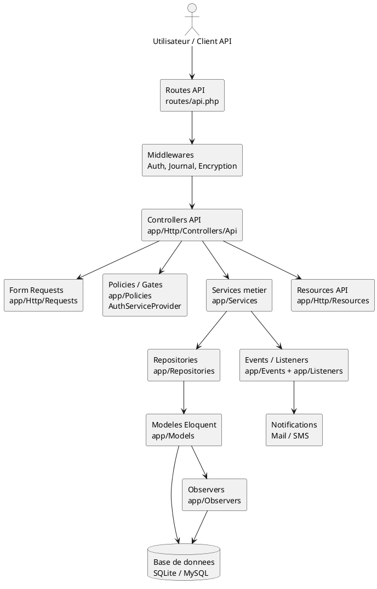
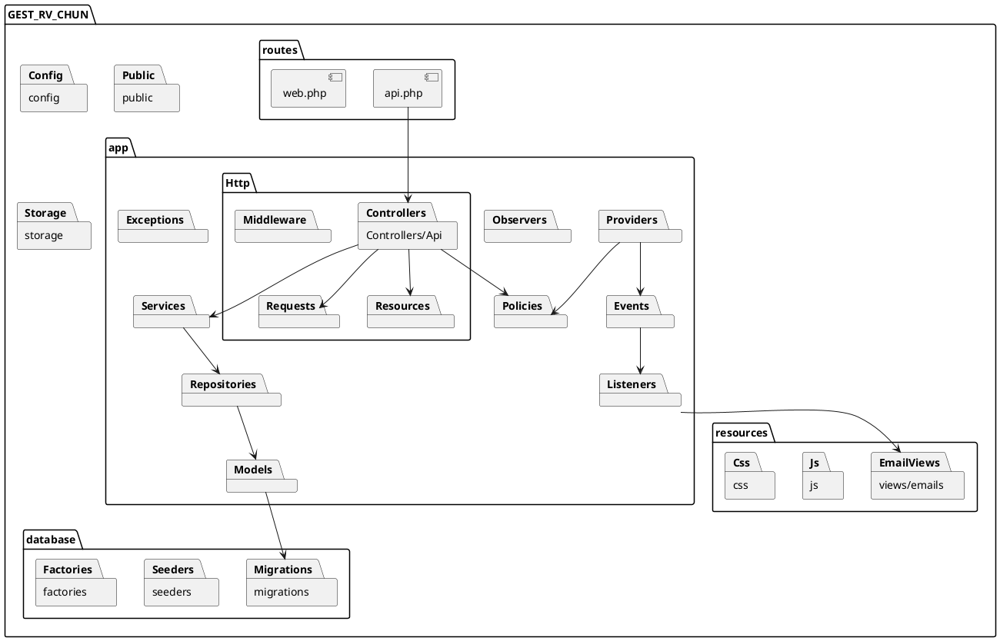
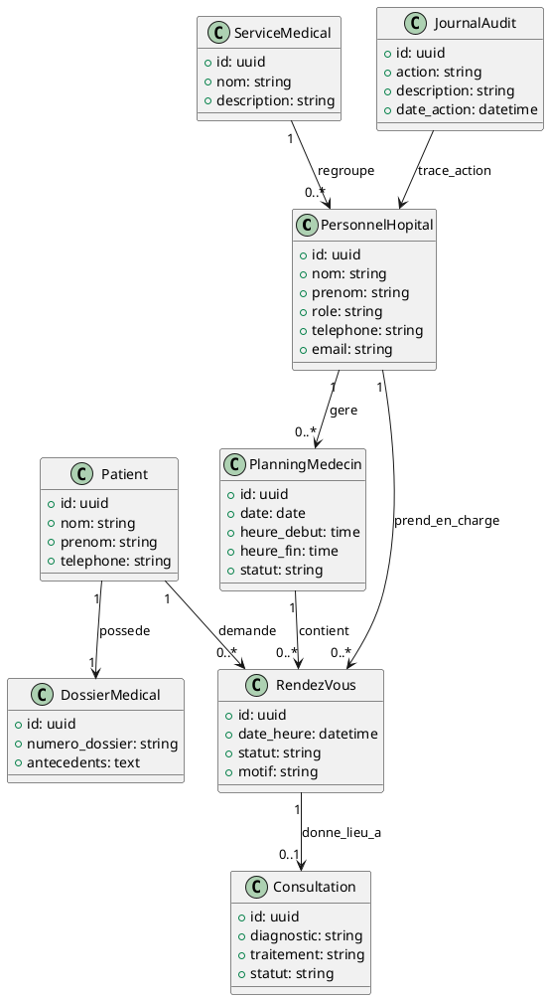

# Architecture UML du projet GEST_RV_CHUN

Ce document présente l'architecture du projet `GEST_RV_CHUN` sur un plan UML, en s'appuyant sur la structure actuelle du code Laravel.

## 1. Diagramme de composants UML

## 2. Diagramme de packages UML

## 3. Diagramme de classes métier simplifié

## 4. Lecture architecturale

Le projet suit principalement le chemin suivant :

1. Le client appelle une route dans `routes/api.php`.
2. La route traverse les middlewares de securite et de journalisation.
3. Le controller API recoit la requete et s'appuie sur une `FormRequest` pour la validation.
4. Les autorisations sont controlees via `Policies` et `Gates`.
5. La logique metier est executee dans `app/Services`.
6. Les acces aux donnees sont centralises dans `app/Repositories`.
7. Les entites et relations sont representees par les `Models`.
8. La reponse sortante est formatee par les `Resources`.
9. Certains traitements declenchent des `Events` puis des `Listeners` pour les notifications email/SMS.

## 5. Fichiers pivots a citer dans un memoire

- `routes/api.php` : point d'entree des fonctionnalites metier.
- `app/Http/Controllers/Api/` : orchestration des cas d'usage exposes par l'API.
- `app/Http/Requests/` : validation des donnees entrantes.
- `app/Services/` : coeur de la logique metier.
- `app/Repositories/` : abstraction des acces aux donnees.
- `app/Models/` : modelisation des entites du domaine medical.
- `app/Policies/` et `app/Providers/AuthServiceProvider.php` : gestion des droits d'acces.
- `app/Events/` et `app/Listeners/` : traitements asynchrones ou decouples.
- `app/Observers/` : reactions automatiques sur les modeles.
- `database/migrations/` : structure physique de la base de donnees.
- `resources/views/emails/admin-credentials.blade.php` : gabarit d'email d'activation/identifiants.

## 6. Modules fonctionnels visibles dans le code

- Gestion des utilisateurs : administrateurs, medecins, secretaires, patients.
- Authentification et activation : login, changement de mot de passe, activation par token.
- Gestion des services medicaux.
- Gestion des plannings des medecins.
- Gestion des rendez-vous.
- Gestion des consultations.
- Gestion des dossiers medicaux.
- Journal d'audit et statistiques.

## 7. Legende simple pour soutenance

- `Routes` : exposent les endpoints.
- `Controllers` : coordonnent les traitements.
- `Services` : portent les regles metier.
- `Repositories` : recuperent et manipulent les donnees.
- `Models` : representent les tables/metiers.
- `Policies` : controlent les permissions.
- `Events/Listeners` : gerent les notifications et actions decouplees.
- `Resources` : standardisent les reponses JSON.

## 8. Fichiers concrets a montrer avec le diagramme

- `routes/api.php`
- `app/Http/Controllers/Api/AdminController.php`
- `app/Http/Controllers/Api/AuthController.php`
- `app/Http/Controllers/Api/RendezVousController.php`
- `app/Services/Admin/CreateAdminService.php`
- `app/Services/Activation/ActivationService.php`
- `app/Services/RendezVous/CreateRendezVousService.php`
- `app/Repositories/RendezVousRepository.php`
- `app/Models/RendezVous.php`
- `app/Models/Patient.php`
- `app/Models/PlanningMedecin.php`
- `app/Providers/AuthServiceProvider.php`
- `app/Providers/EventServiceProvider.php`
- `resources/views/emails/admin-credentials.blade.php`
